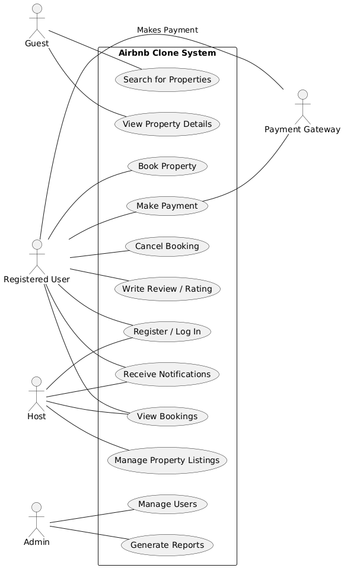

# Requirement Analysis in Software Development

## 📘 Introduction

Welcome to the **Requirement Analysis Repository** the cornerstone of our software development process.  
This repository serves as a **comprehensive guide** for understanding, documenting, and validating all functional and non-functional requirements of the project before moving into design and implementation.

The **objective** of this repository is to ensure that every stakeholder, from clients to developers, shares a unified understanding of the system’s goals, scope, and expected outcomes. Through structured requirement analysis, we aim to minimize miscommunication, control project boundaries, and provide a solid framework for design, development, and quality assurance.

### 🚀 Why Requirement Analysis Matters

- **🔍 Clarity and Understanding:** Promotes a shared vision of stakeholder expectations, reducing ambiguity and misinterpretation.  
- **📏 Scope Definition:** Establishes clear project boundaries to prevent uncontrolled scope expansion.  
- **🧠 Foundation for Design & Development:** Acts as a reference point for creating scalable, maintainable, and user focused systems.  
- **⏱️ Cost & Time Estimation:** Enables precise forecasting of resources, schedules, and budget allocations.  
- **✅ Quality Assurance:** Ensures that the delivered product aligns with documented requirements, enhancing reliability and customer satisfaction.

In essence, this repository forms the **strategic foundation** of the project guiding every stage of execution with **clarity, precision, and purpose**.

## 🧭 What is Requirement Analysis?

**Requirement Analysis** is a critical phase in the **Software Development Lifecycle (SDLC)** that focuses on identifying, gathering, and analyzing the needs and expectations of stakeholders for a proposed software system.  
It serves as the foundation upon which all subsequent phases including design, development, testing, and deployment are built.  

During this phase, the project team collaborates closely with clients, end-users, and other stakeholders to translate business objectives into clear, measurable, and actionable software requirements. These requirements are then documented in various forms such as **Software Requirement Specification (SRS)** documents, **use cases**, **user stories**, and **process models**.

---

### 🔍 The Core Objectives of Requirement Analysis
- **Understand Stakeholder Needs:** Identify what users and business owners truly need from the system.  
- **Define System Boundaries:** Clearly establish what the system will and will not do to avoid ambiguity.  
- **Document Requirements Precisely:** Create detailed, validated documentation that acts as a single source of truth for all project stakeholders.  
- **Facilitate Communication:** Bridge the gap between technical and non-technical team members, ensuring alignment on project goals.  

---

### ⚙️ Importance of Requirement Analysis in the SDLC

Requirement Analysis is not just the first step it’s the **most crucial** step in the software development lifecycle. Its impact is felt throughout every stage of the project:

- **🧩 Foundation for System Design:**  
  The success of the design and architecture phase heavily depends on how well the requirements are defined. A strong requirement base leads to a well-structured and maintainable system.

- **📈 Improved Project Planning:**  
  Accurate requirements enable precise estimation of timelines, budgets, resources, and potential risks, contributing to more predictable project outcomes.

- **🚫 Prevention of Scope Creep:**  
  Clearly defined requirements establish project boundaries and help manage stakeholder expectations, preventing unplanned changes or feature additions.

- **🧪 Enhanced Quality Assurance:**  
  Test plans and validation criteria are derived directly from documented requirements, ensuring that the final product meets business goals and user expectations.

- **🤝 Better Stakeholder Satisfaction:**  
  When the delivered product aligns with documented needs, it builds trust, enhances user satisfaction, and strengthens long-term client relationships.

---
## 💡 Why is Requirement Analysis Important?

Requirement Analysis is one of the most **critical phases** in the Software Development Lifecycle (SDLC). It ensures that all project activities from design and development to testing and deployment are guided by a clear understanding of what the software must achieve. Without proper analysis, teams risk building a product that fails to meet stakeholder needs or exceeds time and cost constraints.

Below are three key reasons why Requirement Analysis is essential in the SDLC:

---

### 1. 🎯 Ensures Clear Understanding and Alignment  
Requirement Analysis helps bridge the communication gap between stakeholders, users, and developers.  
It ensures everyone has a **shared understanding** of the project’s goals, expected outcomes, and constraints.  
By identifying and documenting the precise needs of the system early on, the project team can minimize misunderstandings and avoid costly rework later in the development cycle.

---

### 2. 🧱 Establishes a Strong Foundation for Design and Development  
Well-defined requirements act as a **blueprint** for the design and development phases.  
They guide developers and designers in making informed decisions about system architecture, interface design, and functionality.  
When the requirements are clear and validated, the implementation process becomes more structured, consistent, and efficient reducing the risk of design flaws or missing features.

---

### 3. ⏱️ Enhances Project Planning, Cost, and Quality Management  
Requirement Analysis provides accurate insights into **project scope**, helping project managers estimate timeframes, resources, and budgets more effectively.  
It also enables early identification of potential risks and dependencies, which leads to better mitigation strategies.  
Ultimately, this phase contributes to **higher quality assurance**, ensuring that the final product aligns with both business objectives and user expectations.

---
## 🔧 Key Activities in Requirement Analysis

The **Requirement Analysis** phase involves a series of structured activities that ensure a comprehensive understanding of what the software system must deliver. Each activity contributes to the creation of precise, validated, and actionable requirements that guide the rest of the Software Development Lifecycle (SDLC).

Below are the five key activities involved in Requirement Analysis:

---

### 1. 🗂️ Requirement Gathering  
This is the initial step where information is collected from stakeholders to understand their needs, goals, and expectations.  
Key methods used in this process include:

- **Interviews:** Conducting one-on-one or group interviews with stakeholders to capture detailed insights about system needs.  
- **Surveys/Questionnaires:** Distributing structured surveys to gather input from a larger audience.  
- **Workshops:** Organizing collaborative sessions with stakeholders to discuss, clarify, and refine requirements.  
- **Observation:** Watching end-users in their real work environment to understand workflows, challenges, and pain points.  
- **Document Analysis:** Reviewing existing systems, reports, and documentation to identify current functionalities and areas for improvement.

---

### 2. ✍️ Requirement Elicitation  
This step focuses on **extracting** meaningful requirements through interactive and creative engagement with stakeholders.  
It aims to uncover both stated and unstated needs. Common techniques include:

- **Brainstorming:** Facilitating group discussions to generate diverse ideas and possible system requirements.  
- **Focus Groups:** Conducting discussions with selected stakeholder groups to gain deeper insights into specific requirements.  
- **Prototyping:** Developing early models or mockups to help stakeholders visualize proposed features and refine their feedback.

---

### 3. 📚 Requirement Documentation  
Once requirements are gathered and elicited, they are formally documented to ensure clarity, traceability, and shared understanding across the team.  
Common documentation artifacts include:

- **Requirement Specification Document (SRS):** A comprehensive document detailing all functional and non-functional requirements.  
- **User Stories:** Descriptions of system functionalities from the user’s perspective, often used in Agile environments.  
- **Use Cases:** Diagrams or narratives that illustrate interactions between users (actors) and the system to achieve specific goals.

---

### 4. 📊 Requirement Analysis and Modeling  
This activity involves evaluating and structuring the gathered requirements to ensure they are feasible, consistent, and aligned with project objectives.  
Typical tasks include:

- **Requirement Prioritization:** Ranking requirements based on business value, urgency, and impact.  
- **Feasibility Analysis:** Assessing each requirement’s practicality in terms of technical, financial, and time constraints.  
- **Modeling:** Creating visual representations such as **data flow diagrams (DFDs)**, **entity-relationship diagrams (ERDs)**, and **system models** to clarify complex requirements.

---

### 5. ✅ Requirement Validation  
The final step ensures that all documented requirements accurately reflect stakeholder needs and are ready for implementation.  
It focuses on verification, approval, and traceability. Key activities include:

- **Review and Approval:** Presenting documented requirements to stakeholders for confirmation of accuracy and completeness.  
- **Acceptance Criteria:** Defining measurable conditions that each requirement must meet to be considered successfully implemented.  
- **Traceability:** Creating a **traceability matrix** to map each requirement to corresponding design, development, and testing elements, ensuring full coverage throughout the SDLC.

---

## 🧩 Types of Requirements

In the development of the **Airbnb Clone Application**, understanding and defining the **types of requirements** is crucial for delivering a product that functions seamlessly and provides an exceptional user experience.  

Requirements are generally categorized into two main types: **Functional Requirements** and **Non-functional Requirements**.  
Both are essential in ensuring that the system not only performs the required operations but also does so efficiently, securely, and reliably just like the real **Airbnb** platform.

---

### ⚙️ Functional Requirements

**Definition:**  
Functional requirements describe the **specific features and operations** the system must perform.  
They define how users interact with the application, the data it processes, and how the system responds to various actions.

**Detailed Examples for the Airbnb Clone:**

#### 🏠 1. Property Listing Management  
- Hosts should be able to **create, edit, and delete** property listings with details such as title, description, location, amenities, price, and images.  
- The system should validate mandatory fields before allowing the listing to go live.  
- Listings should be visible to users only after admin or automated verification.

#### 🔍 2. Property Search and Filtering  
- Guests should be able to **search for listings** based on parameters like location, check-in/check-out dates, number of guests, and property type.  
- The system should support **advanced filters** (e.g., price range, room type, amenities, ratings).  
- Search results should be retrieved from an **Elasticsearch index** for fast and relevant responses.

#### 📅 3. Booking and Reservation System  
- Guests should be able to **book properties** by selecting available dates.  
- The system should prevent double bookings through real-time availability checks.  
- Upon confirmation, booking details should be stored in a **booking database**, and both host and guest should receive notifications.  

#### 💳 4. Payment Processing  
- The system should integrate with **third-party payment gateways** (e.g., Stripe, PayPal) for secure transactions.  
- Payments should support multiple currencies and handle cancellations or refunds automatically.  
- All payment activities should be logged for audit and compliance purposes.

#### 👥 5. User Account Management  
- Users should be able to **register, log in, and manage their profiles**.  
- The system should support **two user roles** *Host* and *Guest* each with different permissions and dashboards.  
- Users should be able to upload a profile picture, verify their identity, and view booking history.

#### 💬 6. Messaging and Notifications  
- Hosts and guests should be able to **communicate through an in-app messaging system**.  
- The system should send **real-time notifications** (via email, SMS, or push notifications) for booking confirmations, payment receipts, and updates.  
- Notification services should be managed asynchronously using a **message queue system** like Kafka or RabbitMQ.

#### ⭐ 7. Reviews and Ratings  
- Guests should be able to **leave reviews and star ratings** for their stays.  
- Hosts can respond to reviews to maintain transparency.  
- The system should display average ratings and recent reviews on property pages.

#### 🧭 8. Admin Management Dashboard  
- Admins should be able to **manage users, listings, and transactions** through a secure admin panel.  
- The system should include **analytics and reporting tools** to monitor platform activity and performance.

---

### 🧠 Non-functional Requirements

**Definition:**  
Non-functional requirements describe **how the system performs its functions**.  
They define quality standards, operational constraints, and performance goals that ensure the system runs efficiently and scales effectively.

**Detailed Examples for the Airbnb Clone:**

#### ⚡ 1. Performance and Speed  
- The system should handle **up to 50,000 concurrent users** without performance degradation.  
- Page load time should not exceed **2 seconds**, even under high traffic.  
- **Redis caching** should be implemented to reduce database load and improve response time for frequently accessed data.

#### 🌍 2. Scalability  
- The application should follow a **microservices architecture**, allowing independent scaling of services like booking, payments, and messaging.  
- Use of **load balancers** (e.g., NGINX or AWS ELB) to distribute user requests evenly across multiple servers.  
- Databases (e.g., PostgreSQL for transactions, Elasticsearch for search, Cassandra for archival) should support horizontal scaling.

#### 🔒 3. Security and Privacy  
- All communications must use **HTTPS (SSL/TLS encryption)** to protect data in transit.  
- Passwords should be stored using **bcrypt or Argon2 hashing** algorithms.  
- Implement **OAuth 2.0 or JWT authentication** for secure access control.  
- Sensitive data (like payment details) must comply with **PCI-DSS** standards.  
- Regular security audits and vulnerability scans should be performed.

#### ☁️ 4. Availability and Reliability  
- The system should maintain **99.9% uptime** through redundant servers and database replication (master-slave or cluster-based).  
- Implement **auto-recovery** mechanisms for failed services and data synchronization through **Kafka streams**.  
- Use **CDNs (Content Delivery Networks)** to ensure fast global content delivery.

#### 🧾 5. Data Consistency and Integrity  
- All booking and payment transactions must maintain **ACID compliance**.  
- Synchronize data between caching systems, message queues, and databases to prevent inconsistencies.  
- Implement **event-driven updates** to ensure real-time synchronization between services.

#### 💬 6. Usability and Accessibility  
- The UI should be **intuitive, responsive, and mobile-friendly**, ensuring users can book properties effortlessly.  
- Follow **WCAG accessibility guidelines** to accommodate users with disabilities.  
- Provide consistent navigation, typography, and branding throughout the interface.

#### 🧠 7. Maintainability and Extensibility  
- Codebase should follow **modular and component-based architecture** (e.g., React, Next.js for frontend).  
- Proper **API documentation** should be maintained using tools like Swagger or Postman.  
- Future features (e.g., loyalty programs, gift cards) should be easy to integrate without major redesign.

#### 📈 8. Monitoring and Analytics  
- Implement **real-time monitoring tools** (e.g., Prometheus, Grafana) to track system performance and user activity.  
- Store event logs in **Elasticsearch** for analysis and debugging.  
- Generate periodic reports for business insights, such as most booked locations, user engagement, and revenue growth.

## 📊 Use Case Diagrams

### 🎯 Objective  
Provide a **visual representation** of the interactions between different users (actors) and the system, helping to clarify the functionalities and user roles within the **Airbnb Clone Booking System**.

---

### 🧠 What are Use Case Diagrams?

**Use Case Diagrams** are part of the **Unified Modeling Language (UML)** and are widely used in **Requirement Analysis** to illustrate how users interact with a system to accomplish specific goals.  
They provide a **high-level overview** of the system’s functionality and the relationships between users (actors) and system processes (use cases).

In simpler terms, a Use Case Diagram answers the question:  
> “Who does what in the system?”

---

### 🧩 Creating Use Case Diagrams

When designing a **Use Case Diagram** for the Airbnb Clone Booking System, the following key elements are identified:

#### 👥 Actors
Actors represent the different types of users or external systems that interact with the application:
- **Guest (Visitor)** – Can search and view property listings but cannot book until registered.  
- **Registered User (Customer)** – Can search, book, pay, and review properties.  
- **Host (Property Owner)** – Can add, manage, and update property listings.  
- **Admin** – Oversees system operations, user management, and overall platform maintenance.  
- **Payment Gateway** – An external system that handles secure financial transactions.  

#### ⚙️ Use Cases
Use cases describe the key functionalities or actions that users can perform:
- **Register / Log In**
- **Search for Properties**
- **View Property Details**
- **Book Property**
- **Make Payment**
- **Cancel Booking**
- **Write Review / Rating**
- **Manage Property Listings**
- **View Bookings**
- **Receive Notifications**
- **Manage Users (Admin)**
- **Generate Reports (Admin)**

---

### 🧮 Use Case Diagram — Airbnb Clone Booking System

Below is the Use Case Diagram that visually represents the interactions between the **actors** and **use cases** of the system.

---

### 💡 Benefits of Use Case Diagrams

- **🗺️ Visual Clarity:**  
  Offers a clear overview of how users interact with the system, making it easier to understand the system’s scope and functionality.

- **🤝 Improved Communication:**  
  Bridges the gap between technical and non-technical stakeholders, ensuring everyone shares a consistent understanding of system requirements.

- **📋 Requirement Organization:**  
  Helps analysts and developers organize and prioritize features based on user interactions.

- **🧭 Development Guidance:**  
  Serves as a foundational reference during design, development, and testing to ensure that all user goals are met.

---

